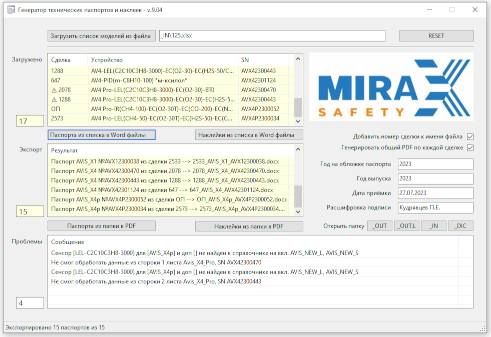

# Mirax.PassportGenerator.Public
This is a description of the project I did for the Mirax-safety company. 
Passport Generator uses data from an internal system to automatically generate and print complex technical passport documents.

## It does:
* Import of an MS Excel file as a data source + sensor data library
* Generation of device passports in MS Word format based on the corresponding Word-template
* Generation of stickers for devices in Word format
* Converting generated documents to PDF format
* Combining multiple documents into one PDF-file by Customer order number

## Technologies used:
*	Base tech: C#, .NET 7, LINQ, Git, Windows, MS Visual Studio
*	Unit testing: MSTest
*	MS Office: EPPlus, Spire.Doc, itext7, Interop, +VBA
*	UI frameworks: WinForms
*	Serializing: Newtonsoft.Json
*	Arch. principles/patterns: YAGNI
